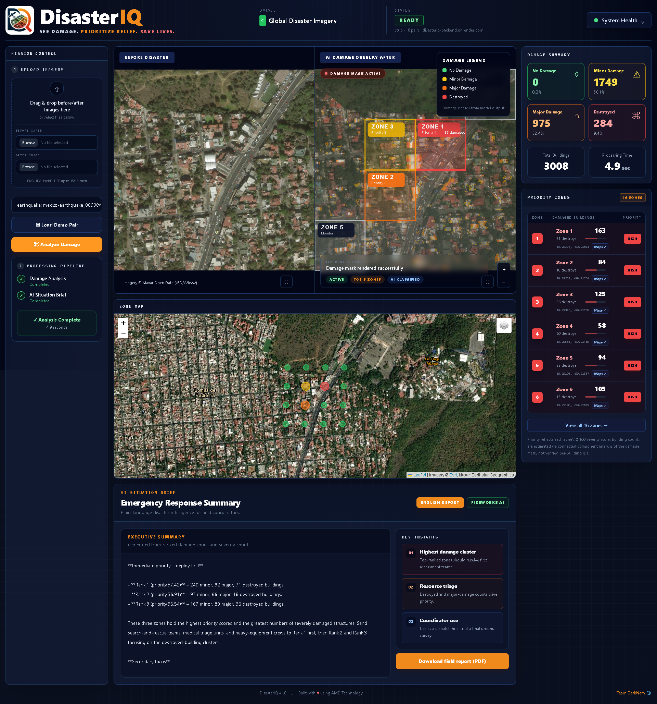

<p align="center">
  
</p>

<h1 align="center"> DisasterIQ</h1>

<p align="center">
  <strong>SEE DAMAGE. PRIORITIZE RELIEF. SAVE LIVES.</strong>
</p>

<p align="center">
  <a href="https://disasteriq.vercel.app/"><strong>🔗 Try the live app → disasteriq.vercel.app</strong></a>
</p>

# 🌍 DisasterIQ

### AI-Powered Disaster Damage Intelligence for Emergency Response

**DisasterIQ transforms before-and-after satellite or aerial imagery into actionable disaster-response intelligence — helping relief teams identify damaged areas, prioritize response zones, and generate rapid field reports.**

---

## 🖥️ Dashboard

<p align="center">
  
</p>

<p align="center"><em>Before/after imagery with an AI damage overlay, ranked priority zones, a damage summary, and an AI-generated situation brief — all in one triage view.</em></p>

---

## 🚀 Access DisasterIQ

DisasterIQ runs entirely in your browser — **no installation, no setup, no download.**

### ▶️ Live app: **[disasteriq.vercel.app](https://disasteriq.vercel.app/)**

**How to use it:**

1. Open the live app in any modern browser.
2. In the **Mission Control** panel, select a demo image pair — or upload your own before/after images.
3. Click **⌘ Analyze Damage**.
4. Explore the results: the AI **damage overlay**, ranked **priority zones**, the **damage summary**, and an AI-generated **situation brief**.
5. Click **Download field report (PDF)** to export a shareable report.

> ⏳ **First load may take ~30–60 seconds** while the free-tier backend wakes from sleep. After that, it's responsive.

<details>
<summary><strong>Run it locally (for developers)</strong></summary>

Requires Python 3.12 and Node.js. From the repo root:

```powershell
# Backend (FastAPI, http://localhost:8000)
.\scripts\start-backend.ps1

# Frontend (Next.js, http://localhost:3000) — in a second terminal
.\scripts\start-frontend.ps1
```

Then open **http://localhost:3000**. See [`DEPLOY.md`](DEPLOY.md) for cloud deployment.

</details>

---

## 🚨 The Problem

When disasters strike, response teams need fast answers:

- Where is the damage most severe?
- Which zones should rescue teams inspect first?
- How many structures appear damaged or destroyed?
- Where should limited relief resources be sent immediately?

Traditional damage assessment often depends on manual ground surveys, which can be slow, dangerous, and incomplete — especially after floods, earthquakes, wildfires, hurricanes, and other large-scale disasters.

**DisasterIQ is built to reduce that delay.**

---

## 🧠 What DisasterIQ Does

DisasterIQ is an AI-powered disaster triage dashboard that analyzes before-and-after imagery and converts it into clear emergency-response insights.

It can:

- 🛰️ Compare pre-disaster and post-disaster imagery
- 🏚️ Detect visible damage patterns
- 🎯 Classify damage severity across affected zones
- 🗺️ Display a visual damage overlay
- 📊 Generate damage summaries
- 📍 Rank priority response zones
- 🧾 Produce an AI-assisted situation brief
- 📄 Export a field-ready disaster damage report

---

## 🌐 Built for Global Disaster Response

DisasterIQ is not limited to one country or one disaster type.

It is designed for global disaster scenarios where before-and-after imagery is available, including:

- 🌊 Floods
- 🌎 Earthquakes
- 🔥 Wildfires
- 🌀 Hurricanes
- ⛰️ Landslides
- 🌪️ Severe storms

Example deployment scenarios include Pakistan floods, Venezuela earthquakes, Turkey/Syria earthquakes, wildfire damage assessments, hurricane-hit coastal regions, and other international disaster-response operations.

---

## ✨ Key Features

### 🛰️ Before / After Image Analysis

Upload or load paired imagery from before and after a disaster event.

### 🎨 Visual Damage Overlay

Damage results are displayed directly over the affected area, making it easier to understand the scale and location of destruction.

### 📊 Damage Summary

The dashboard summarizes affected structures and damage severity in a clear visual format.

### 📍 Priority Zone Ranking

DisasterIQ ranks zones based on severity, helping emergency teams decide where to respond first.

### 🧾 Situation Brief

The system generates a concise emergency-response brief that explains the damage pattern and recommended next steps.

### 📄 Field Report Export

Users can export a structured disaster damage report for response teams, coordinators, and stakeholders.

---

## 🎯 Damage Severity Levels

| Severity | Description |
|---|---|
| 🟢 No Damage | Area or structure appears largely unaffected |
| 🟡 Minor Damage | Light visible damage or limited disruption |
| 🟠 Major Damage | Significant visible damage requiring urgent inspection |
| 🔴 Destroyed | Severe destruction or likely structural collapse |

---

## 🖥️ Demo Workflow

```text
Load or Upload Disaster Image Pair
              ↓
View Before / After Comparison
              ↓
Run Damage Analysis
              ↓
Display Damage Overlay
              ↓
Generate Damage Summary
              ↓
Rank Priority Zones
              ↓
Create Situation Brief
              ↓
Export Field Damage Report
```

---

## 🧩 Technology Stack

### Frontend

- ⚛️ Next.js
- 🟦 TypeScript
- 🎨 Tailwind CSS
- 🖼️ Interactive disaster dashboard
- 📊 Visual damage summary and zone ranking

### Backend

- 🐍 Python
- ⚡ FastAPI
- 🖼️ Image processing pipeline
- 📡 REST API
- 📄 Report generation

### AI & Acceleration

- 🖥️ Damage analysis on **AMD EPYC** (verify at [`/compute`](https://disasteriq-backend.onrender.com/compute))
- 🤖 Situation briefs on **AMD Instinct** via [Fireworks AI](https://fireworks.ai/partners/amd)
- 🔥 PyTorch + ROCm fine-tune pipeline (shipped; see [AMD compute](#-amd-compute))

---

## 📦 Dataset & Fine-Tuning

DisasterIQ builds on the open **xView2 / xBD building-damage dataset** — paired
pre- and post-disaster satellite imagery with per-building damage labels.

### Getting the data

The full dataset is large (train and test archives are ~10 GB each), so it is
**not stored in this repository** (it is git-ignored). Download it directly from
the official source:

- 🔗 **Official dataset:** [xview2.org](https://xview2.org) — free registration required
- The download provides the pre/post image pairs plus labels and target masks

This repo already ships **ten curated demo pairs** (`data/demo/images/`, with
matching xBD labels and ground-truth target masks) so the app runs
end-to-end out of the box, no download needed.

### Curate demo pairs from the full dataset

After downloading and extracting the test archive to `data/test/`:

```powershell
.\scripts\curate_demo_subset.ps1
```

This copies the pairs listed in `data/demo/manifest.json` into `data/demo/`.

### Inference modes

The backend picks its damage model from `INFERENCE_MODE` in `.env`:

| Mode | What it runs | Per-zone confidence |
|---|---|---|
| `stub` | A pre/post pixel-difference heuristic — co-registration, illumination matching, percentile thresholding, connected-component filtering | — |
| `docker` | The official xView2 TF 1.15 baseline, in a container | — |
| `pytorch` | A fine-tuned checkpoint (`ml/checkpoints/damage_best.ckpt`) | ✅ |

Only `pytorch` produces class probabilities, so `confidence` is reported for
that mode alone. See [`ml/README.md`](ml/README.md) for details.

**The hosted demo runs `stub`, and it is a heuristic, not a learned model.**
Every input goes through it — the shipped demo pairs and a stranger's upload
alike. The xBD ground-truth masks in `data/demo/targets/` are used only to rank
the demo dropdown and for offline evaluation; they are never served as model
output. An earlier build did short-circuit to them for demo pairs, which made
the demo look far better than the system was, and that path has been removed.

A consequence worth knowing before you read the dashboard: the heuristic detects
*change*, so it cannot label an undamaged building (class 1). "No Damage" reads
0 in `stub` mode by construction. Distinguishing an intact building from bare
ground needs the trained model.

`docker` mode requires building the baseline image first:

```powershell
docker compose --profile build-ml build ml
```

The first `docker`-mode analysis is slow (~2 min: TF 1.15 cold start plus two
models), so `stub` remains the default for a responsive live demo.

### Fine-tuning

Fine-tuning runs on a **PyTorch** fork of xView2, not the TF 1.15 baseline —
TensorFlow 1.15 has no practical ROCm build. Extract the train archive, filter
to the target hazard types with `scripts/prepare_train_subset.py`, then:

```bash
bash ml/finetune/run_amd_notebook.sh   # AMD Instinct / ROCm notebook
bash ml/finetune/run_amd_pipeline.sh   # AMD Instinct / ROCm over SSH
bash ml/finetune/run_kaggle_pipeline.sh  # CUDA fallback
```

The notebook script also captures the AMD hardware evidence described in
[`docs/AMD_COMPUTE.md`](docs/AMD_COMPUTE.md). Full runbook in
[`ml/finetune/README.md`](ml/finetune/README.md).

**Status: not executed.** We could not get working hackathon GPU access, so no
checkpoint ships and `pytorch` mode is untested end-to-end.

---

## 🧪 Development

```powershell
# Backend tests
cd backend; .\.venv\Scripts\python.exe -m pytest tests/ -v

# ML inference tests (CPU only — no GPU or checkpoint needed)
python -m pytest ml/pytorch-inference/tests/ -v

# Frontend
cd frontend; npm run typecheck; npm run lint; npm run build
```

CI runs all of the above on every push and pull request
(see [`.github/workflows/ci.yml`](.github/workflows/ci.yml)).

---

## 📌 Use Cases

DisasterIQ can support:

- 🚑 Emergency response coordination
- 🏚️ Building damage assessment
- 🌍 Humanitarian relief planning
- 🛰️ Satellite imagery analysis
- 🧭 Disaster zone prioritization
- 📋 Rapid field reporting
- 🏛️ Government and NGO response planning

---

## 🏆 Hackathon Context

DisasterIQ was developed for the **AMD Developer Hackathon: ACT II — Unicorn Track**.

The project focuses on practical disaster-response AI, combining computer vision, geospatial reasoning, emergency triage logic, and AMD compute — damage analysis on AMD EPYC, response briefs on AMD Instinct via Fireworks. See [AMD compute](#-amd-compute).

---

## ⚡ AMD compute

Every request DisasterIQ serves executes on AMD silicon. You do not have to take
this on faith — the deployment reports its own hardware:

```bash
curl https://disasteriq-backend.onrender.com/compute
{"cpu_model":"AMD EPYC 7R13 Processor","cpu_vendor":"AMD","cpu_count":8,
 "inference_mode":"stub","brief_model":"accounts/fireworks/models/gpt-oss-120b"}
```

**Damage analysis runs on an AMD EPYC 7R13.** The whole vision pipeline — FFT
phase-correlation alignment, illumination matching, change detection, the
connected-component pass that extracts buildings, and zone scoring — is
NumPy/SciPy work executing on those EPYC cores on every analysis.

**The AI situation brief runs on AMD Instinct GPUs.** Briefs are generated by
`gpt-oss-120b` on [Fireworks AI](https://fireworks.ai/partners/amd), which
serves inference on AMD Instinct hardware under a multi-year AMD partnership.

**What we did not get to run: the ROCm fine-tune.** The pipeline is written,
committed and documented — [`ml/finetune/run_amd_notebook.sh`](ml/finetune/run_amd_notebook.sh)
stages the xBD subset, patches upstream xView2, trains the siamese U-Net across
both stages on an Instinct GPU, and captures `rocm-smi` and the HIP device as
evidence ([`docs/AMD_COMPUTE.md`](docs/AMD_COMPUTE.md)). We never obtained
working hackathon GPU access to execute it, so **no trained checkpoint ships and
the hosted demo runs the heuristic**, not a learned model. We would rather say
that plainly than imply a model we are not running.

---

## 📊 Current Capabilities

DisasterIQ currently supports:

- ✅ Disaster dashboard interface
- ✅ Before / after imagery display
- ✅ Demo image pair loading
- ✅ Damage analysis workflow
- ✅ Visual damage overlay
- ✅ Damage summary cards
- ✅ Priority zone ranking
- ✅ AI-style situation brief generation
- ✅ PDF field report export
- ✅ Frontend and backend integration
- ✅ Optional API key and per-IP rate limiting on the expensive endpoints
- ✅ Automated test suite and CI (backend, ML, frontend)

---

## 📄 Report Output

DisasterIQ can generate a field-ready report containing:

- Disaster image pair information
- Damage severity summary
- Priority zone ranking
- Situation brief
- Response recommendations
- Field coordination notes

---

## 🌟 Project Vision

DisasterIQ is built around a simple idea:

> In a disaster, faster intelligence can lead to faster response.

By turning disaster imagery into structured response information, DisasterIQ aims to help emergency teams move from raw visuals to real decisions faster.

---

## ⚠️ Disclaimer

DisasterIQ is a hackathon prototype and decision-support tool.

It is not a replacement for professional disaster assessment, satellite imagery experts, structural engineers, or verified field reports. All AI-generated outputs should be reviewed and validated before real-world operational use.

---

## 👥 Team

Built by **Team DarkNem**

---

## 📜 License

DisasterIQ's own source code is released under the **[Apache License 2.0](LICENSE)**.

Third-party components retain their own licenses — see [`NOTICE`](NOTICE) for full
attribution. In particular, the **xView2 / xBD dataset** is licensed under
**CC BY-NC-SA 4.0 (non-commercial use only)**, and the **xView2 baseline** model
is under an MIT (SEI)-style license from Carnegie Mellon University.

---

## 💡 Final Message

**DisasterIQ helps turn disaster imagery into emergency response intelligence.**

### See damage. Prioritize relief. Save lives.
